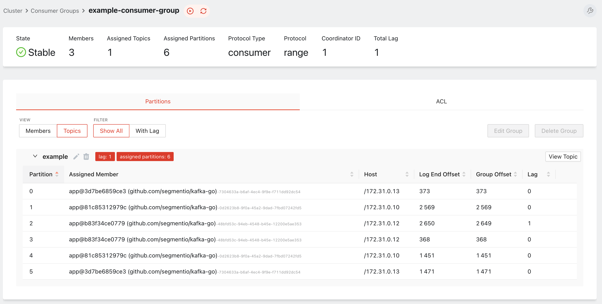
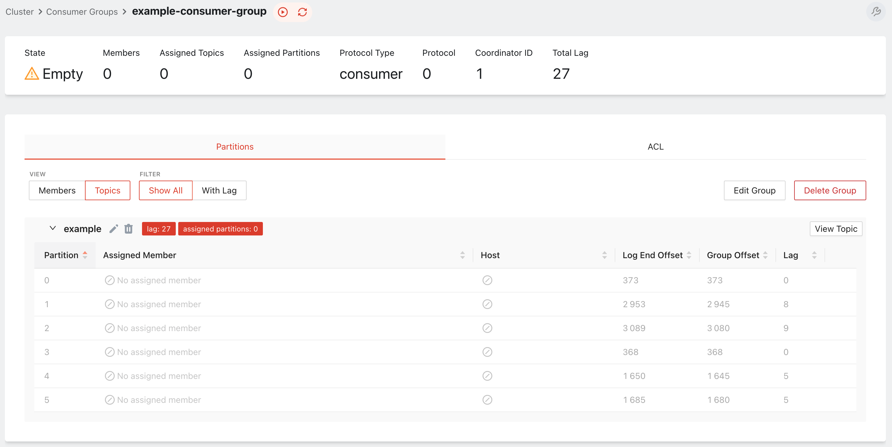
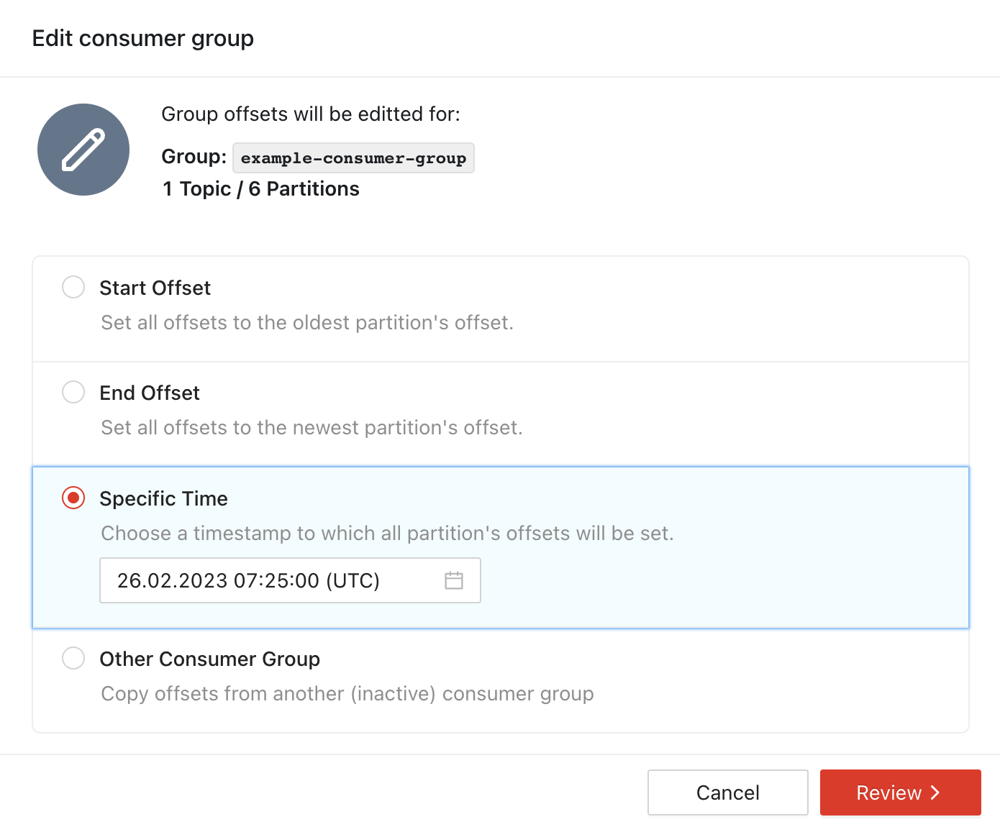
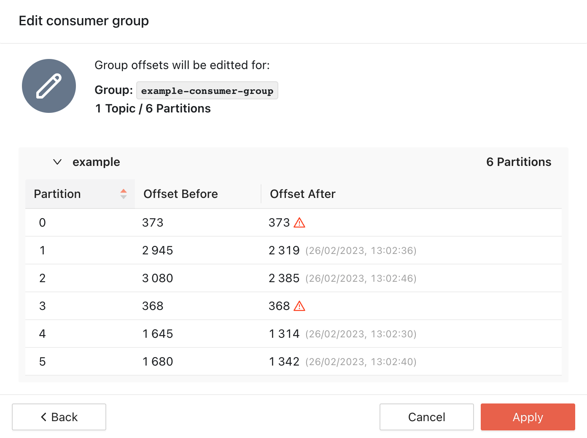
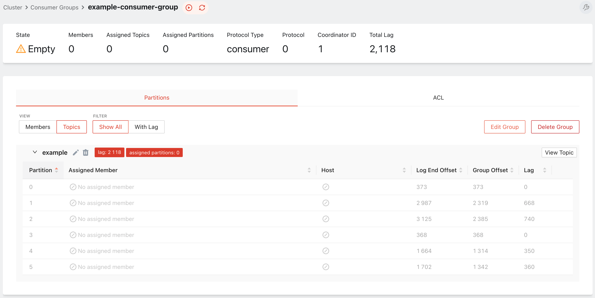
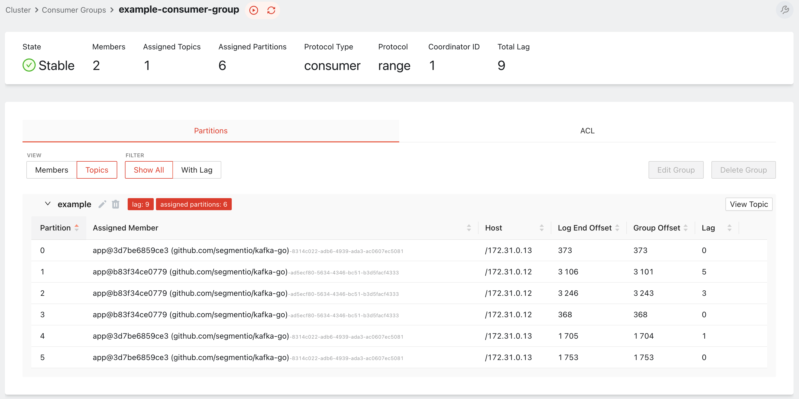

# Работа с консумерами

## Запуск консумеров

Мы также подготовили консумер на Go: программа читает топик и распечатывает сообщение на экран. В тестовом кластере сейчас работает сразу три консумера — все они представляют собой один и тот же экземпляр запущенной программы.

Посмотрите пример прочитанных событий:

```bash
docker-compose --profile app logs -f consumer-1 consumer-2 consumer-3
```

```
consumer-3  | 2023/02/26 09:27:17 message at topic/partition/offset example/2/2597: 5 = {"id":5,"lat":70.305836,"lon":-82.353797}
consumer-2  | 2023/02/26 09:27:17 message at topic/partition/offset example/5/1446: 6 = {"id":6,"lat":-68.561725,"lon":41.288281}
consumer-2  | 2023/02/26 09:27:17 message at topic/partition/offset example/5/1447: 6 = {"id":6,"lat":-18.154029,"lon":-62.287865}
consumer-1  | 2023/02/26 09:27:17 message at topic/partition/offset example/4/1421: 1 = {"id":1,"lat":-50.646267,"lon":10.077705}
consumer-1  | 2023/02/26 09:27:17 message at topic/partition/offset example/4/1422: 1 = {"id":1,"lat":-47.339896,"lon":-33.38711}
```

Обратите внимание, что каждый консумер читает только события, связанные соответствующим ключом. Это возможно благодаря партицированию по хешу со стороны продюсера.

Откройте исходный [код консумера](../../examples/consumer/main.go) и посмотрите описание `kafka.Reader`. Программа подключается к брокерам, поллит данные в соответствии с выбранной минимальной величиной байт для одной пачки данных (`MinBytes`) и максимальным размером сообщения (`MaxBytes`).

```go
r := kafka.NewReader(kafka.ReaderConfig{
	Brokers:  addrs,
	GroupID:  group,
	Topic:    topic,
	MinBytes: 10e2, // 1KB
	MaxBytes: 10e6, // 10MB
})
```

Само чтение же представляет собой бесконечный цикл:
- Чтение пачки данных
- Обработка
- Коммит оффсета

В представленном примере чтение данных и коммит оффсета совмещены в функции `ReadMessage` и выполняются неявно (implicit).

```go
for {
    m, err := r.ReadMessage(context.Background())
    if err != nil {
	    break
    }
    log.Print(fmt.Sprintf("message at topic/partition/offset %v/%v/%v: %s = %s\n", m.Topic, m.Partition, m.Offset, string(m.Key), string(m.Value)))
}
```

Однако обе эти операции могут быть выполнены явно (explicit). Например, сначала вы считываете порцию данных, обрабатываете её, а уже в самом конце — коммитите оффсет, перемещаясь к следующей порции записей. Например:

```go
ctx := context.Background()
for {
    m, err := r.FetchMessage(ctx)
    if err != nil {
        break
    }
    log.Print(fmt.Sprintf("message at topic/partition/offset %v/%v/%v: %s = %s\n", m.Topic, m.Partition, m.Offset, string(m.Key), string(m.Value)))
    if err := r.CommitMessages(ctx, m); err != nil {
        log.Fatal("failed to commit messages:", err)
    }
}
```

Для простоты оба примера иллюстрируют синхронную работу консумера, но для улучшения производительности операции могут быть выполнены и асинхронно.

## Управление консумер-группой

Посмотрим на консумер-группу детальнее. Откройте веб-интерфейс [Redpanda Console](http://localhost:8080/groups/example-consumer-group), перейдите на вкладку "Consumer groups" и откройте профиль консумер-группы `example-consumer-group`.



На странице видно, что в группу `example-consumer-group` входят три консумера, каждый из которых определяется уникальным именем (Assigned member) и адресом узла (Host). Важно, что каждый консумер в группе читает одну или несколько партиций, однако одна партиция может быть прочитана только одним консумером в текущей группе.

Каждый консумер в группе характеризуется текущим оффсетом (Group Offset) относительно конечного оффсета партиции (Log End Offset). Расстояние между конечным оффсетом партиции и текущим оффсетом группы является лагом (Lag).

Вы можете управлять положением оффсета консумер-группы на уровне брокера. Например, если вам требуется прочитать сообщения за пределами текущего оффсета, вы можете переместить его на позицию в любое другое место. 

Однако для этого важно, чтобы консумер-группа была **пуста**: то есть, в ней не было **ни одного** участника.

Остановите имеющиеся консумеры.

```bash
docker-compose --profile app stop consumer-1 consumer-2 consumer-3
```

Обновите страницу [Redpanda Console](http://localhost:8080/groups/example-consumer-group).



Консумер-группа пуста (Empty). Теперь вы можете отредактировать её (Edit group). Переключите оффсет для всей группы, «отмотав» его на 5 минут назад.



Подтвердите изменение.



Готово. Обратите внимание на значения лага партиций.



Теперь, когда мы запустим консумеры, они вновь вернутся к чтению с обозначенных позиций. Запустите остановленные консумеры:

```bash
docker-compose --profile app start consumer-1 consumer-2 consumer-3
```

Посмотрите на лог консумер-групп и убедитесь, что сообщения были прочитаны повторно.

```bash
docker-compose --profile app logs -f consumer-1 consumer-2 consumer-3
```

## Ребалансировка консумер-группы

Любая смена композиции в консумер-группе (например, добавление или выход участника из группы, а также изменение числа партиций) приводит к её ребалансировке — процессу перераспределения партиций между «живыми» участниками. Сейчас в консумер-группе три консумера, каждый из которых читает две партиции.

Остановите один из работающих консумеров, перейдите на страницу консумер-группы в [Redpanda Console](http://localhost:8080/groups/example-consumer-group). 

```bash
docker-compose --profile app stop consumer-1
```

Сначала никаких изменений не будет, а после, на короткое время, группа перейдёт в состояние `PreparingRebalance`.


В этот момент все консумеры прекращают чтение и дожидаются синхронизации всех имеющихся участников в группе. После окончания ребалансировки, партиции перераспределяются между участниками и консумеры продолжают чтение с сохранённых позиций.



Как можно заметить, теперь партиции распределились между двумя консумерами: по три на каждого участника группы.

✅ Готово. Теперь переходите к [изучению метрик Kafka](./006-observability.md).