# Теория. Ментальная модель Kafka.

## Предисловие

В СберМаркете мы широко используем Kafka в качестве шины данных для микросервисов и знаем непонаслышке, что работать с Kafka нужно уметь. Интенсив «Kafka за 90 минут» состоит из двух частей: теоретическая и практическая. 

В теоретической части мы:
- Посмотрим сценарии использования
- Узнаем что такое консумер, продюсер и брокер
- Поймём как связаны топики, партиции и сегменты
- Посмотрим на формат сообщения Kafka
- Поймём зачем нужен лидер партиции и как реплицируются данные
- Зачем нужно партицирование
- Узнаем какие есть гарантии доставки сообщений
- Затронем идемпотентность обработки событий
- Определим что такое консумер-группа
- Посмотрим на ребалансировку консумеров

## Предпосылки

Долгое время инженеры разрабатывали программы, оперирующие объектами реального мира, сохраняя состояние о них в базы данных. Будь то, например, пользователи, заказы или товары. Представление о вещах мира как об объектах широко распространено среди ИТ-разработки (будь то парадигма ООП), однако сейчас больше компаний и технических команд всё чаще предпочитают думать не о самих объектах, а событиях, которые они порождают — то бишь, изменениях объектов во времени.

Популярность событийно-ориентированного подхода вызвана стремлением компаний снизить связность сервисов друг с другом (что крайне важно при микросервисной трансформации) и улучшить устойчивость приложений к сбоям за счёт изоляции поставщиков данных и их потребителей.

События, проходящие в системах, как и объекты, также можно хранить в традиционных реляционных базах данных, однако это достаточно громоздко и неэффективно. Вместо этого мы используем структуру под названием лог.

## Устройство Apache Kafka

**Лог** — это упорядоченный поток событий во времени. Некоторое событие происходит и попадает всегда в конец лога, оставаясь неизменным.

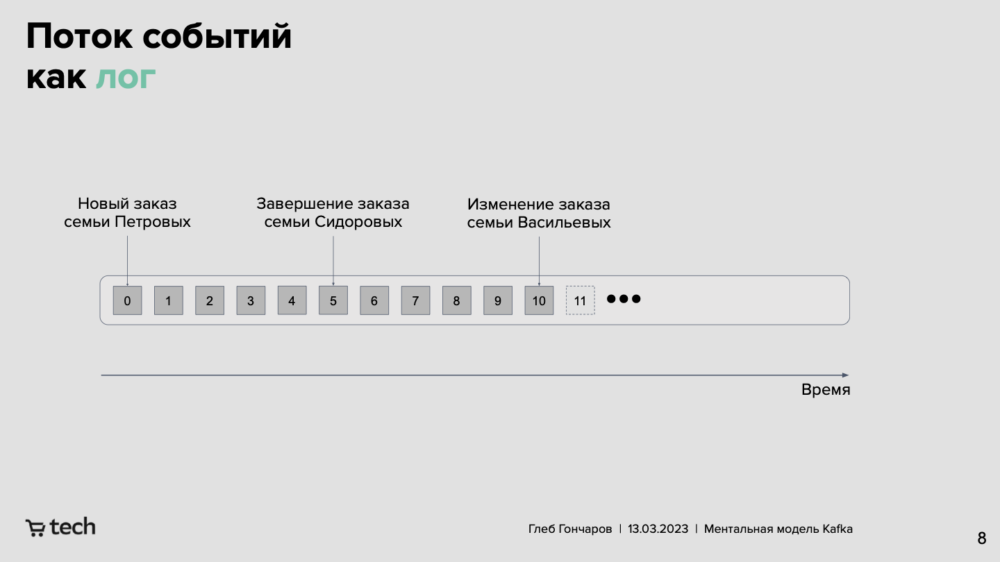

**Apache Kafka** — это система по управлению такими логами и платформа, призванная соединить поставщиков данных и их потребителей, предоставив возможность получать упорядоченный поток событий в реальном времени.

### Продюсеры

Чтобы записать события в кластер Kafka, есть продюсеры. **Продюсер** — это приложение, которое вы разрабатываете.

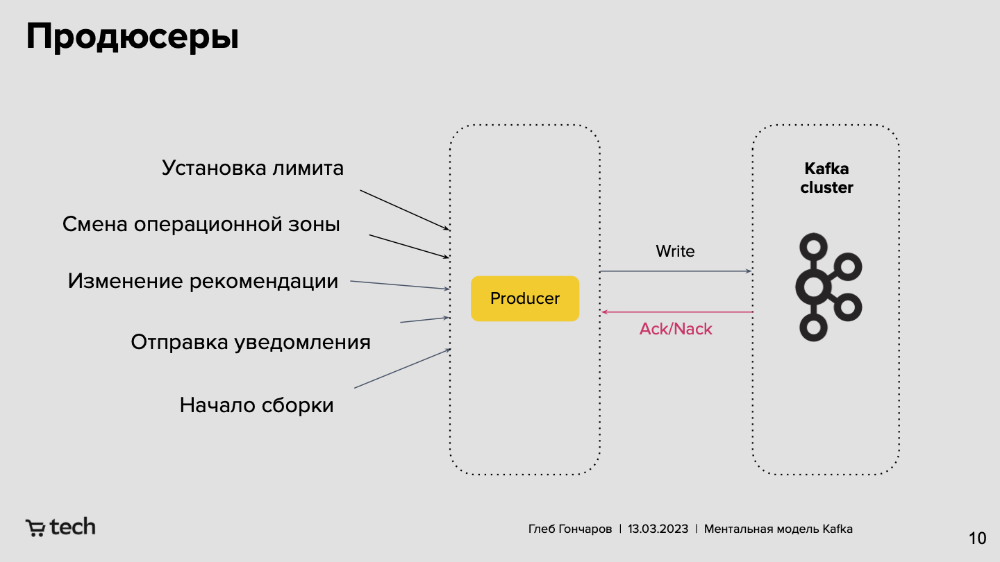

Программа-продюсер записывает сообщение в Kafka, а Kafka сохраняет события, возвращает подтверждение (_acknowledgement_) о записи, продюсер получает его и начинает следующую запись. И так далее.

### Брокеры

Сам же кластер Kafka состоит из брокеров. Представьте себе дата-центр и серверы в нём. В первом приближении думайте о Kafka-брокере как о компьютере: это процесс в операционной системе с доступом к своему локальному диску. 

Все брокеры соединены друг с другом сетью, действуя сообща как единый Kafka-кластер. Когда продюсеры пишут события в Kafka-кластер, они работают с брокерами в нём.

В облачной среде Kafka-кластер не обязательно работает на выделенных серверах, а может быть виртуальными машинами или контейнерами в Kubernetes. Главное — каждый кластер Kafka состоит из брокеров.

### Консумеры

События, записанные продюсерами на локальные диски брокеров, могут быть прочитаны консумерами. **Консумер** — это также приложение, которое вы разрабатываете. В этом случае по-прежнему кластер Kafka — это нечто, обслуживаемое инфраструктурой, но что делаете вы как пользователь — пишете продюсер и консумер. Программа-консумер подписывается на события (поллит) и получает данные в ответ. И так по кругу.

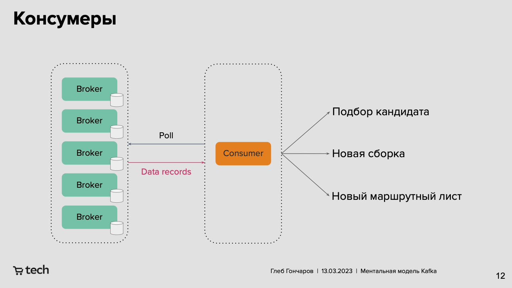

Консумером может быть программа, подбирающая кандидата на основе координат партнёра, или при появлении заказа — инициирующая новую сборку. При этом консумер также может быть и продюсером, создавая новые события для размещения в Kafka для других сервисов.

---

  
TL;DR

Основы кластера Kafka — это продюсер, брокер и консумер. Продюсер пишет сообщения в лог брокера, а консумер его читает.

---

## Архитектура Kafka

Итак, давайте посмотрим на архитектуру Kafka внимательнее. Слева есть продюсеры, в середине брокеры, а справа — консумеры. Kafka же представляет собой группу брокеров, связанных с Zookeeper-кворумом. Kafka использует Zookeeper для достижения консенсуса состояния в распределённой системе: есть несколько вещей, с которыми должен быть «согласен» каждый брокер и Zookeeper помогает достичь этого «согласия» внутри кластера.

> _Начиная с Kafka 3.4 необходимость в использовании Zookeeper отпала: для арбитража используется собственный протокол KRaft, решающий те же задачи, но на уровне брокеров, однако для простоты мы пока остановимся на традиционной схеме_.

Так вот, Zookeeper представляет собой выделенный кластер серверов для образования кворума и поддержки внутренних процессов Kafka. Благодаря Zookeeper, кластером Kafka можно управлять: добавлять пользователей, топики и задавать им настройки.

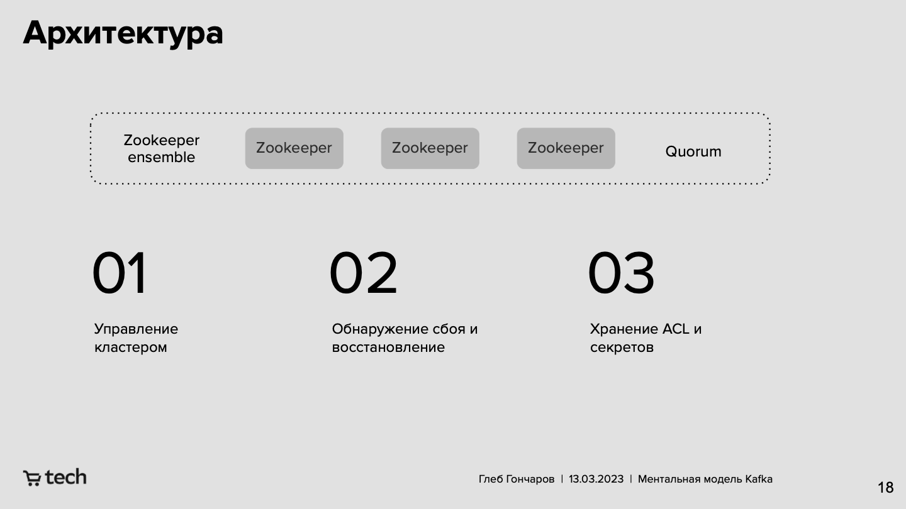

Zookeeper также помогает при обнаружении сбоя в мастере, провести выборы нового и сохранить работоспособность кластера Kafka. И, что немаловажно, Zookeeper хранит в себе все авторизационные данные и ограничения (Access Control Lists) при работе консумеров и продюсеров с брокерами.

---

  
TL;DR

Кластер Kafka позволяет изолировать консумеры и продюсеры друг от друга. Продюсер ничего не знает о консумерах при записи данных в брокер, а консумер — ничего не знает о продюсере данных.

---

## Устройство брокеров

Теперь поговорим отдельно о брокерах. Наверняка вы несколько раз слышали про какие-то топики, теперь коротко о том, что это такое. События в Kafka-брокерах образуют топики.

### Топики

Топик — это логическое представление категорий сообщений в группы. Например, события по статусам заказов, координат партнёров, маршрутных листов и так далее.

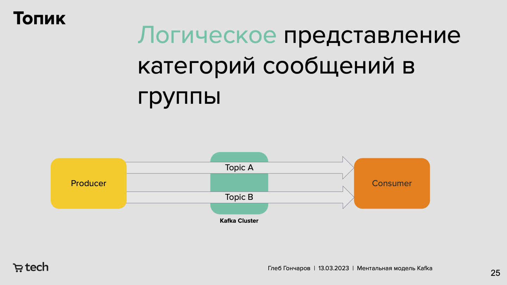

Ключевое слово здесь — **логическое**. Мы создаём топики для событий общей группы и стараемся не смешивать их друг с другом. Например, координаты партнёров не должны быть в том же топике, что и статусы заказов, а обновлённые статусы по заказам — не быть вперемешку с обновлением регистраций пользователей. 

О топике стоит думать как о логе: вы пишете событие в конец, не разрушая при этом старые события. Один продюсер может писать в один или несколько топиков, в один топик могут писать один или более продюсеров, как и много консумеров могут читать из одного топика, как и один консумер может читать сразу несколько топиков.

Теоретически, нет никаких ограничений на число этих топиков, но практически это ограничено числом партиций, о которых мы поговорим позднее.

### Партиции и сегменты

Топиков в кластере Kafka может быть много и нет ограничений на их создание. Однако рано или поздно, компьютер, выполняя операции на процессоре и вводе-выводе, упирается в свой предел. К сожалению, мы не можем увеличивать мощность и производительность компьютеров бесконечно, а потому топик следует делить на части.

В Kafka эти части называются **партициями**. Каждый Kafka-топик состоит из одной или более партиций, каждая из которых может быть размещена на разных брокерах. Это то, благодаря чему Kafka может масштабироваться: пользователь может создать топик, разделить его на партиции и разместить каждую из них на своём брокере.

Формально партиция — это и есть строго упорядоченный лог сообщений. Каждое сообщение в партиции добавлено в конец без возможности изменить его в будущем и как-то повлиять на уже записанные сообщения. При этом сам топик вцелом не имеет никакого порядка, но порядок сообщений всегда есть в одной из его партиций.

Партиции же представлены физически на дисках в виде **сегментов** — отдельных файлов, что могут быть созданы, отротированы или удалены в соответствии с настройкой устаревания данных в них. Обычно, если вы не администрируете кластер Kafka, вам не приходится много думать о сегментах партиций, но вы должны помнить о партициях, как о модели хранения данных в топиках Kafka.

Давайте посмотрим на всё детальнее. В кластере Kafka есть три брокера: 101, 102 и 103. Топик A отмечен бирюзовым, топик B — жёлтым, а C — оранжевым. На картинке я нарисовал их по три у каждого, но число партиций может быть разным у каждого топика — это настраивается для каждого топика.

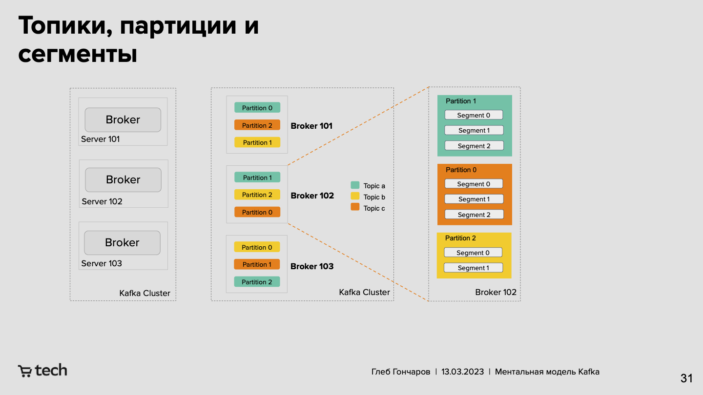

Как вы видите, партиции как-то распределены между брокерами — кластер Kafka делает это автоматически при создании топика. Kafka автоматически не следит за размером каждой партиции, не занимается ребалансировкой записи и чтения в кластере, не перемещает партиции между брокерами. Конечно же, для этого уже существуют как опенсорс-инструменты, так и готовые enterprise-платформы как Confluent, но эту часть мы сейчас пропустим.

Так вот, как вы видите, каждая партиция на брокере представлена набором сегментов. Число сегментов у партиций топиков тоже может быть разным и варьируется в зависимости от интенсивности записи и настроек размера сегмента.

Итак, таким образом, увеличивая число брокеров в кластере, мы можем масштабировать систему. Kafka поддерживает добавление или удаление брокеров в кластере и с помощью встроенных инструментов позволяет, например, переносить партиции между брокерами, равномерно распределяя их.

Позволяет добавлять новые партиции в топике, тем самым увеличивая параллелизм записи и чтения со стороны продюсера и консумера соответственно.

Позволяет изменять настройки сегментов и, тем самым, управлять частотой и интенсивностью ротации отдельных файлов на дисках брокеров. Давайте посмотрим подробнее на устройство сегмента.

#### Поток данных как лог

Предлагаю думать о сегменте как об обычном лог-файле: каждая следующая запись добавляется в конец файла и не меняет записей раньше. Фактически, это очередь FIFO (First-In-First-Out) и Kafka реализует именно эту модель. LIFO (Last-In-First-Out), очереди с приоритетами — мимо, это не про Kafka.

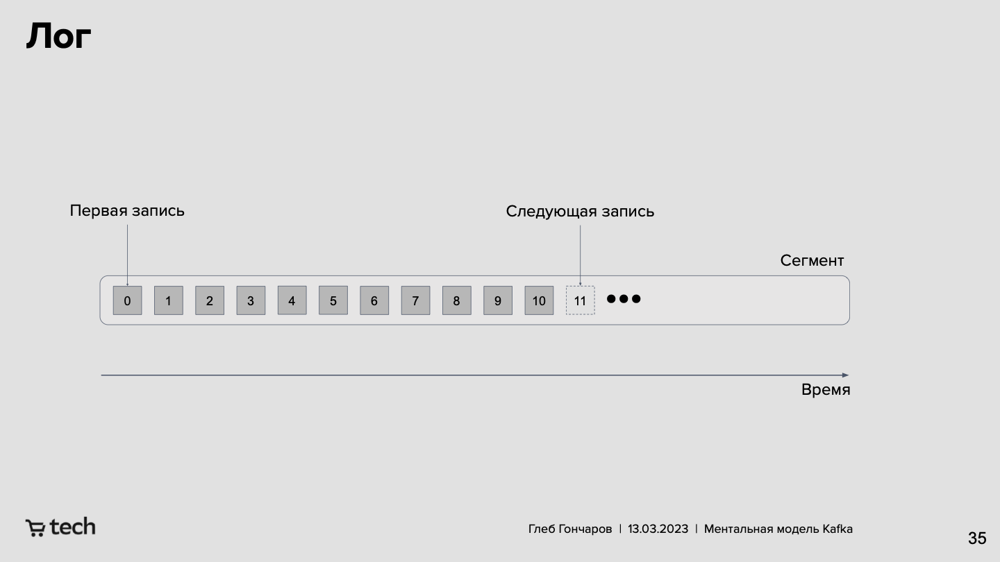

Говоря о сегменте, и семантически, и физически, сообщения внутри сегмента не могут быть удалены: они иммутабельны. Всё, что мы можем указать — это как долго Kafka-брокер будет хранить события, настраивая политику устаревания данных (Retention Policy).

Числа внутри сегмента — это реальные сообщения системы. Эти сообщения имеют порядковый номера или оффсеты, что монотонно увеличиваются со временем. У каждой партиции свой собственный счётчик, никак не пересекающийся с другими партициями. Так, позиции 0, 1, 2, 3 и так далее у каждой партиции своя. Таким образом, продюсеры пишут сообщения в партиции, а брокер адресует каждое из таких сообщений своим порядковым номером. 

> Если вам интересно, есть ли у этого есть свой предел: то технически — да, но практически едва ли. Если писать по 1ТБ в день, то счётчик исчерпается где-то через 4 млн. дней или чуть меньше 11000 лет.

Так вот, помимо продюсеров, что пишут сообщения, есть консумеры, что их читают. Несмотря на то, что консумеры называются так от слова consume (англ. потреблять), повторюсь, никакого физического потребления или уничтожения сообщения не происходит — он просто их читает.

Это значит, что у лога может быть несколько консумеров, читающих лог с разных позиций, имеющих свою позицию чтения, совершенно не мещающих друг другу. При этом нет никакой необходимости у консумеров читать сообщения сразу же после записи со стороны продюсера. При желании, эти события могут быть прочитаны спустя дни, недели, месяцы, или же их можно прочитать несколько раз спустя какое-то время.

Начальная позиция первого сообщения в логе называется log-start offset. Позиция сообщения, записанного последним — log-end offset. Позиция консумера сейчас — текущим оффсетом или current offset.

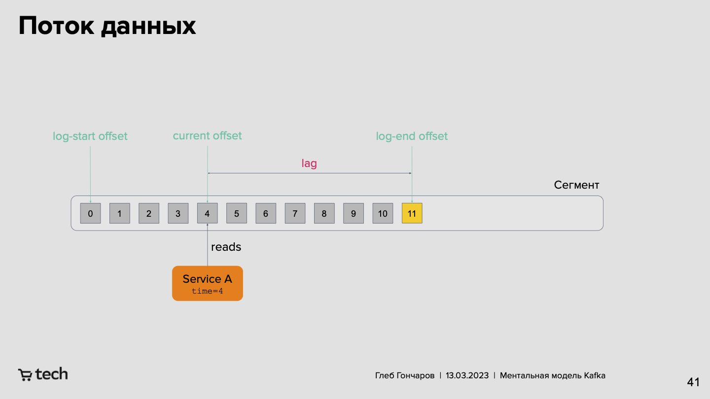

Расстояние между конечным оффсетом и текущим оффсетом консумера называют лагом. Лаг — это первое, за чем стоит следить в своих приложениях. При этом очевидно, что допустимый лаг для каждого приложения свой, что тесно связано с бизнес-логикой и требованиями к работе системы.

Возвращаясь к теме, теперь давайте же посмотрим на то, из чего состоит отдельное сообщение Kafka. Если упростить, то структура сообщения Kafka представлена опциональными заголовками, что могут быть добавлены со стороны продюсера, ключом партицирования, пэйлоадом и временем (timestamp). 

Важно то, что каждое событие — это пара ключ-значение. Ключ партицирования может быть любой: числовой, строковый, объект или вовсе пустой. Значение же также может быть любым и представлено числом, строкой или объектом в своей предметной области, который вы можете как-то сериализовать (JSON, Protobuf, …) и хранить.

В сообщении продюсер также может указать время или же за него это сделает брокер в момент приёма сообщения. Заголовки также опциональны и выглядят как в HTTP-протоколе: просто строковые пары ключ-значение. В них не следует хранить сами данные, но они могут использоваться для передачи мета-данных, например, для трассировки, сообщения MIME-type, цифровой подписи и т.д.

#### Устаревание данных

Возвращаясь к сегментам, стоит также поговорить и о том, как они ротируются — закрываются старые и открываются новые. Когда сегмент достигает своего предела, он закрывается и вместо него открывается новый. Сегмент, в который сейчас записываются данные, называют активным сегментом. По сути, открытый файл процессом брокера. Сегменты, в которых больше нет записи, называются закрытыми.

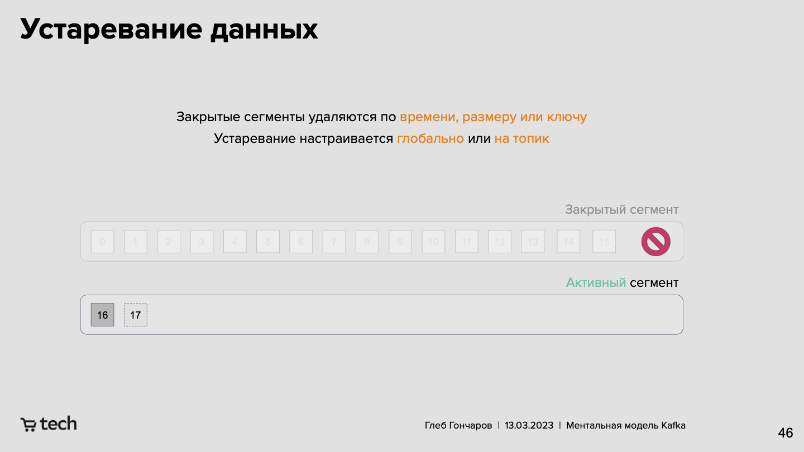

Максимальная длина сегмента в байтах настраивается глобально или индивидуально на каждый топик: его размер определяет как часто старые файлы будут сменяться новыми. Если вы пишете много больших сообщений, то вам следует увеличивать размер сегмента и, наоборот, вам не следует использовать большие сегменты, если вы пишете небольшие сообщения очень редко.

Простыми словами, настроенная политика устаревания не означает, что из топика пропадут события старше, скажем, 7 дней. Kafka удаляет закрытые сегменты партиций, а число таких партиций зависит от размера сегмента и интенсивности записи в партиции.

Однако ничто не мешает хранить сообщения дольше или даже вовсе не удалять их. Многие пользователи ошибочно полагают, что Kafka не предназначен для хранения исторических данных. На мой взгляд, для того нет никаких ограничений, кроме размера дисков и числа брокеров для хранения данных.

#### Репликация данных

Теперь несколько слов о надёжности. Было бы странно, если бы одна партиция могла существовать на одном брокере, ведь в случае сбоя, была бы недоступна часть данных, делая нашу систему хрупкой и ненадёжной. Разумеется, Kafka представляет механизм репликации партиций между брокерами.

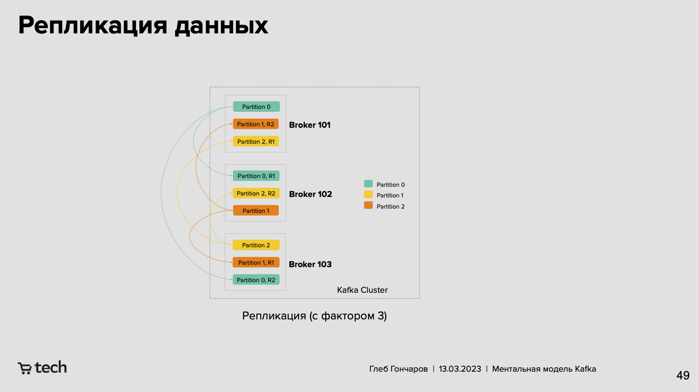

Каждая партиция имеет настраиваемое число реплик, например, три — как указано на изображении. Одна из этих реплик партиции называется лидером, а другие, политкорректно, фолловерами. Продюсер подключается к брокеру, на котором расположена лидер-партиция, чтобы записать в неё данные.

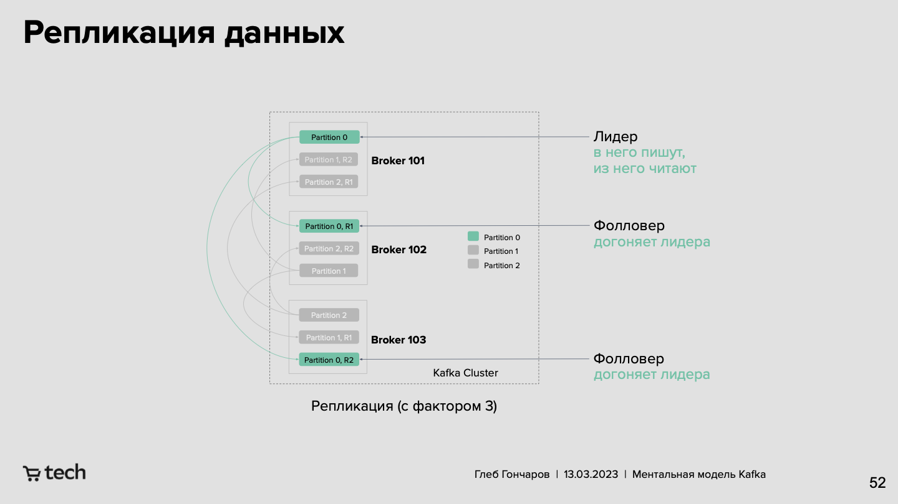

Записанные в лидерскую партицию данные автоматически реплицируются фолловерами внутри кластера Kafka: они подключаются к лидеру, читают данные и сохраняют к себе на диск асинхронно. В хорошо функционирующем кластере Kafka репликация занимает доли секунд.

Консумеры же со своей стороны также читают из лидерской партиции, что позволяет достичь консистентности при работе с данными. Задача же фолловеров, как уже говорил, просто сводится к копированию данных от лидера.

> Начиная с версии 2.4, Kafka поддерживается возможность чтения консумерами из фолловеров, основываясь на их взаимном расположении. Это полезно для сокращения задержек при обращении к ближайшему брокеру, скажем, в одной зоне доступности, однако из-за асинхронной работы репликации, взамен вы получаете от фолловеров менее актуальные данные, чем они есть в лидерской партиции.

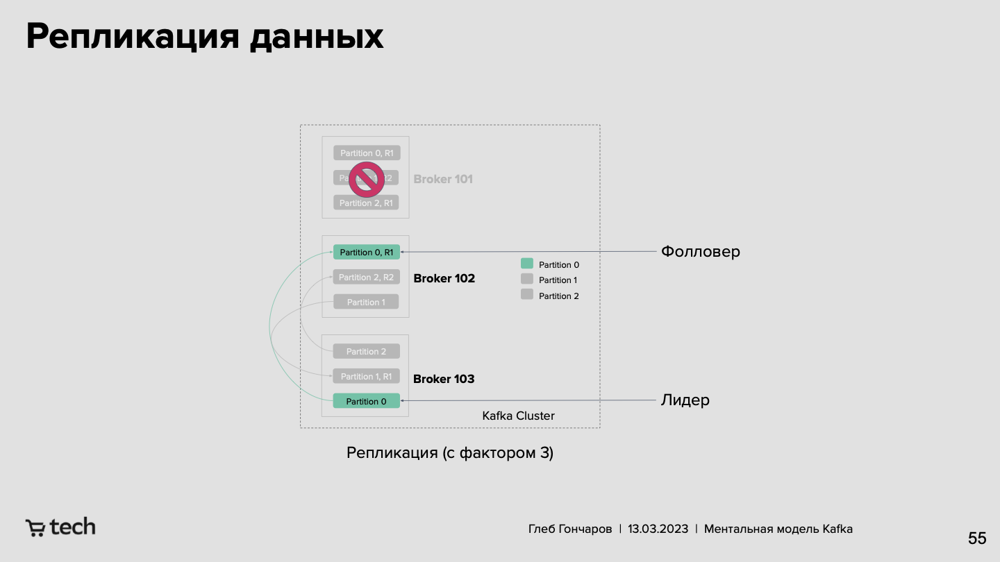

Говоря о лидерах и фолловерах, то эти роли не статичны. Kafka автоматически выбирает лидера и фолловеров партиций в кластере. Так, в случае сбоя брокера, роль лидера достанется одной из реплик, а консумеры и продюсеры, согласно протоколу, должны получить обновления и переподключиться к брокерам с новыми лидерами партиций.

---

  
TL;DR

Топики в Kafka разделены на партиции. Увеличение партиций увеличивает параллелизм чтения и записи. Партиции находятся на одном или нескольких брокерах, что позволяет кластеру масштабироваться.

Партиции хранятся на локальных дисках брокеров и представлены набором лог-файлов — сегментов, запись в которых идёт в конец, а уже сохранённые события — неизменны.

Каждое сообщение в таком логе определяется порядковым номером — оффсетом. Этот номер монотонно увеличивается при записи для каждой партиции.

Лог-файлы на диске устаревают по времени или размеру. Это настраивается глобально или индивидуально в каждом топике. 

Для отказоустойчивости, партиции могут реплицироваться. Число реплик (он же фактор репликации) настраивается как глобально по умолчанию, так и в каждом топике кастомно.

Реплики партициий могут быть лидерами или фолловерами. Традиционно консумеры и продюсеры работают с лидерами, а фолловеры только догоняют лидера.

---

## Продюсеры

Закончив рассматривать брокер, предлагаю перейти к продюсерам и понять принцип их работы. Как мы уже знаем, продюсеры пишут сообщения в партиции, партиции расположены на брокерах, но как продюсер узнаёт о том, какое сообщение и в какую партицию ему записать.

#### Балансировка и партицирование

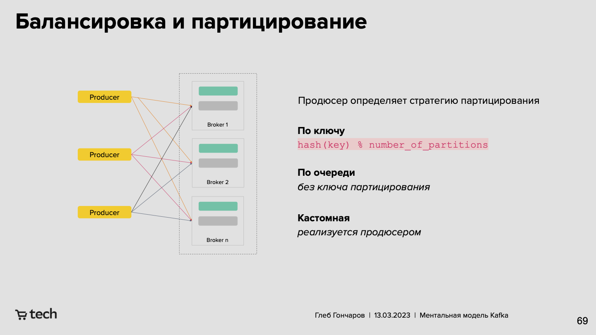

Ответ прост: он знает. Программа-продюсер может указать ключ у сообщения и сама определить номер партиции, например, разделяя вычисленный хеш на число партиций, тем самым сохраняя сообщения одного идентификатора в одну и ту же партицию. Это очень распространённая стратегия партицирования, позволяющая добиться строгой очерёдности событий при чтении за счёт сохранения сообщений в одну партицию, а не в несколько.

Например, этим ключом может быть номер карты при установке и сброса динамического лимита. В таком случае мы гарантируем, что события по одной карте будут следовать строго в порядке их записи в партицию и никак иначе.

Если программа-продюсер не указывает ключ, что стратегия партицирования по умолчанию round-robin — сообщения будут попадать в партиции по очереди. Это неплохая стратегия партицирования в ряде бизнес-сценариев, где не важна очерёдность событий, но равномерное распределение сообщений между партициями. 

Также вы можете реализовать собственную стратегию партицирования, например, используя List-based partitioning, Composite partitioning, Range-based partitioning и другие алгоритмы. Вся логика реализации партицирования данных реализуется на стороне продюсера.

#### Дизайн продюсера

Типичная программа-продюсер работает следующим образом: пэйлоад упаковывается в структуру с указанием топика, партиции и ключа партицирования. Далее пэйлоад сериализуется в подходящий формат (скажем, JSON, Protobuf, Avro или ваш кастомный формат с поддержкой схем), следом сообщению назначается партиция согласно передаваемому ключу и выбранному алгоритму, группируется в пачки выбранных размеров и пересылаются брокеру Kafka для сохранения.

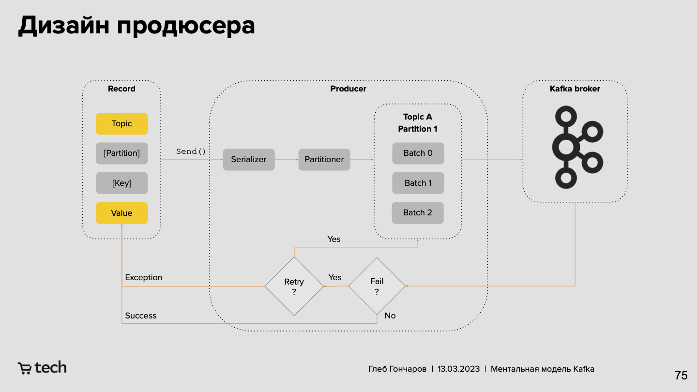

В зависимости от настроек продюсера, тот дожидается окончания записи в кластере Kafka и ответного подтверждающего сообщения. В случае, если продюсер не смог записать сообщение, то, тот может попытаться отправить сообщение повторно. И так по кругу.

Каждый из параметров в цепочке может быть индивидуально настроен каждым продюсером. Например, вы можете выбрать алгоритм партицирования, определить размер батча (выбрав баланс между задержкой и пропускной способностью), а также выбрать семантику доставки сообщений.

#### Семантики доставки

Говоря о семантике доставки, то в любых очередях всегда есть выбор между скоростью доставки и накладными расходами на надёжность. Цветные квадратики на слайде — это сообщения, которые мы будем записывать в очередь, выбирая нужную из семантик.

- Семантика _at-most once_ означает, что при доставке сообщений нас устраивают потери сообщений, но не их дубликаты. Это наиболее слабая гарантия, реализуемая всеми брокерами очередей. 
- Семантика _at-least once_ означает, что мы не хотим терять сообщения, но нас устраивают возможные дубликаты.
- Семантика _exactly-once_ означает, что мы хотим доставить одно и только одно сообщение, ничего не теряя и ничего не дублируя.

На первый взгляд кажется, что любое приложение должно реализовывать семантику exactly once, однако это далеко не всегда так. Например, при передаче партнёрских координат, полагаю, вовсе не обязательно сохранять каждую точку из них и вполне хватит at-most once. Или, скажем, при обработке идемпотентных событий, нас вполне может и устроить дубль, если статусная модель предполагает корректную обработку.

В распределённых системах у exactly-once есть своя цена: высокая надёжность означает высокие задержки. Давайте рассмотрим инструменты, что предлагает Kafka для реализации всех трёх семантик доставки сообщений в брокер.

#### Надёжность доставки

Со стороны продюсера разработчик определяет надёжность доставки сообщения до Kafka с помощью параметра acks. Указывая `0` (`none`), в других библиотеках название может отличаться, продюсер будет отправлять сообщения в Kafka, не дожидаясь никаких подтверждений записи на диск со стороны брокера.

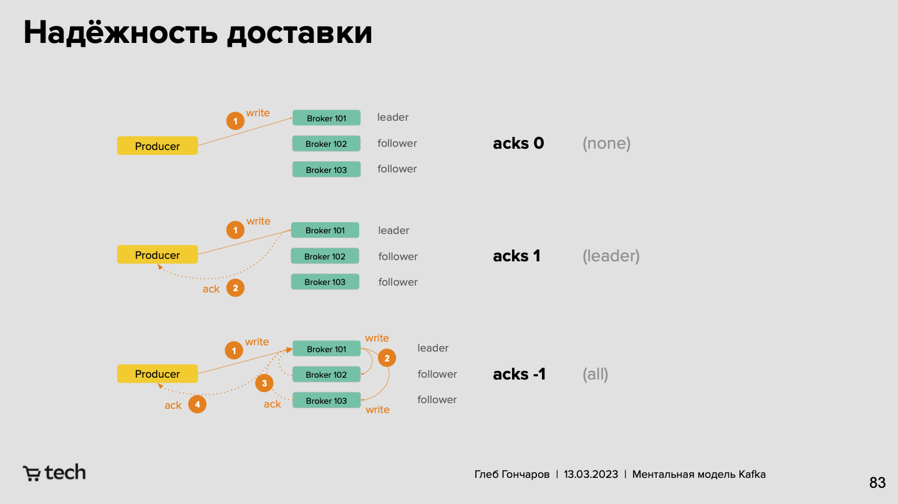

Это самая слабая гарантия, поскольку в случае выхода брокера из строя или сетевых проблем, вы так и не узнаете о том, попало ли сообщение в лог или же просто потерялось.

Указывая настройку в `1` (`leader`), продюсер при записи будет дожидаться ответа от брокера с лидерской партицией. Это будет означать, что сообщение сохранено на диск одного брокера. В этом случае вы получаете гарантию того, что сообщение было получено по крайней мере один раз, однако это по-прежнему не страхует вас от проблем в самом кластере.

Представьте, что в момент подтверждения брокер с лидерской партиции выходит из строя, а фолловеры не успели отреплицировать с него данные. В таком случае вы теряете сообщение и снова не узнаёте об этом. Такие ситуации редки, но возможны.

И, наконец, устанавливая acks в `-1` (`all`), вы просите брокера с лидерской партицией отправить вам подтверждение только тогда, когда запись попадёт не только на локальный диск брокера, но и в реплики-фолловеры. Число этих реплик устанавливается настройкой `min.insync.replicas`.

Частой ошибой при конфигурировании топика является выбор `min.insync.replicas`, равным числу реплик. Так, в случае выхода из строя брокера и потери одной реплики, продюсер более не сможет записать сообщение в кластер, поскольку не дождётся подтверждения. Рекомендуется устанавливать `min.insync.replicas` на единицу меньше числа реплик, чтобы переживать такие ситуации. Например, для фактора репликации `3` — это значение равно `2`.

Очевидно, что третья схема достаточно надёжна, но и требует больше накладных расходов: мало того, чтобы нужно сохранить на диск, так ещё и дождаться, пока фолловеры отреплицируют сообщения и сохранят их к себе на диск в лог.

#### Идемпотентные продюсеры

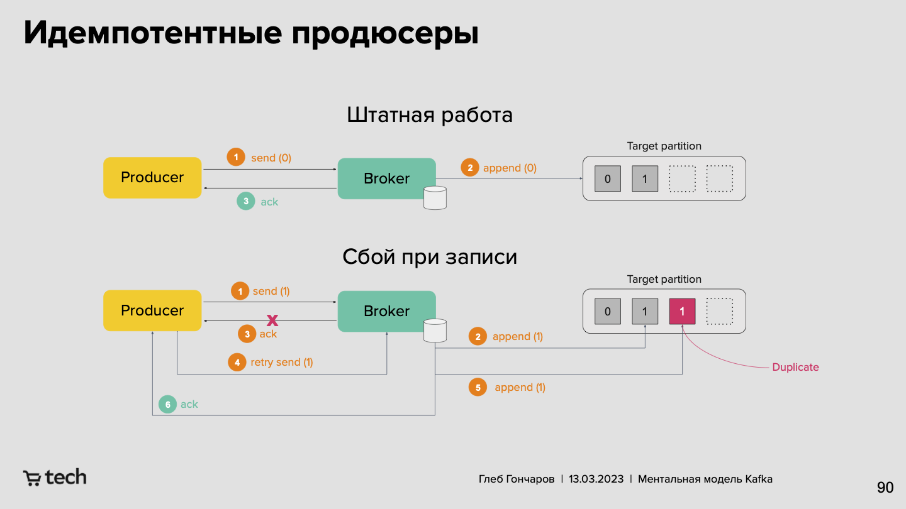

Однако даже с выбором `acks=all`, по-прежнему возможны дубликаты сообщений. В штатном режиме работы продюсер отправляет сообщение брокеру, а тот сохраняет данные в логе на диске, и отправляет подтверждение продюсеру. После чего тот снова формирует новую пачку сообщений и так далее. Однако так бывает не всегда: в работе программ бывают различные сбои и что-то может пойти не так.

А что, если брокер не смог отправить подтверждение продюсеру из-за сетевых проблем? В таком случае, продюсер повторно отправляет сообщение брокеру. Брокер послушно сохраняет добавляет ещё одно сообщение в лог, образуя дубликат.

Эта проблема также решается в Kafka благодаря транзакционному API и использованию идемпотентности. В брокере есть специальная опция, включающая идемпотентность (`enable.idempotence`). Так каждому сообщению будет проставлен идентификатор продюсера (PID) и монотонно увеличивающийся sequence number (как, например, реализовано в протоколе TCP). Благодаря этому, сообщения дубликаты от одного продюсера с одинаковым PID будут отброшены на стороне брокера.

Строго говоря, если вы используете `acks=all`, то нет никаких причин не включать `enable.idempotence` для своих продюсеров. Так вы добьётесь гарантии exactly once при записи в брокер и избежите дубликатов, однако, как я уже отметил, у этого могущества есть своя цена — запись будет проходить дольше.

---

  
TL;DR

Продюсеры партицируют данные в топиках самостоятельно. Он также сам определяет алгоритм партицирования: он может быть как банальный round-robin и hash-based, так и кастомный, реализованный программистом. Важно помнить, что очерёдность сообщений гарантируется только для одной партиции.

Продюсер волен сам выбрать размер батча и число ретраев при отправке сообщений. Протокол Kafka предоставляет гарантии доставки всех трёх семантик: at-most once, at-least once и exactly-once.

При этом exactly once нужен не каждому сервису. Оцените потребности ваших приложений и используйте настройки с умом. 

У exactly once есть цена. Для надёжной записи вам необходимо использовать подтверждение как от лидера, так и от реплик, включить идемпотентность и использовать транзакционный API. Всё это сказывается на времени записи.

Не забывайте, что сломаться в пути может что угодно: например, просесть сеть или сломаться сам брокер. Переходящие процессы в кластере, как выбор лидера, редкость, но это случается, а клиенты должны уметь их грамотно обрабатывать.

Если вы хотите писать в Kafka надёжно, указывайте при создании топика `min.insync.replicas` меньше, чем всего реплик. В противном случае, лишившись брокера в случай аварии, вы рискуете вовсе ничего не записать, поскольку не сможете дождаться подтверждения записи.

Если уж вы и указываете `acks=all`, то включайте и `enable.idempotence`. Накладных расходов на идемпотентность нет.

---

## Консумеры

О брокерах поговорили, о продюсерах — тоже. Теперь о консумерах: как программы-консумеры читают данные из Kafka. 

#### Дизайн консумера

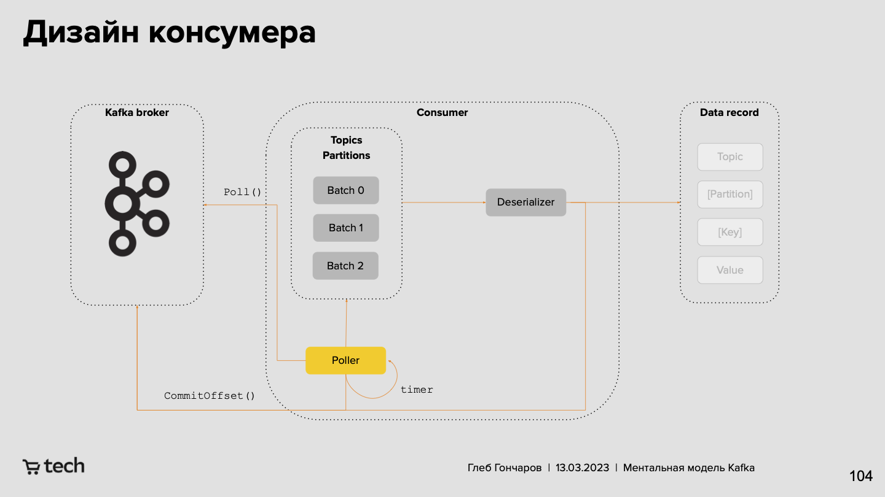

Типичная программа-консумер работает так: при запуске внутри консумера работает таймер, что периодически поллит новые записи из партиций брокеров. Поллер получает список батчей, связанных с топиками и партициями, из которых читает консумер. Далее полученные сообщения в батчах десериализуются. Далее консумер, как правило, как-то обрабатывает сообщения.

В конце чтения консумер может закоммитить оффсет — запомнить позицию считанных записей и продолжить чтение новой порции данных. Читать можно как синхронно, так и асинхронно. Оффсет можно коммитить или не коммитить вовсе.

Главное здесь, что консумер периодически вычитывает новую порцию данных, десериализует их и следом обрабатывает.

#### Консумер-группы

Однако было бы странно, если бы чтением всех партиций занимался только один консумер. Они могут быть объединены в кластер — **консумер-группы**.

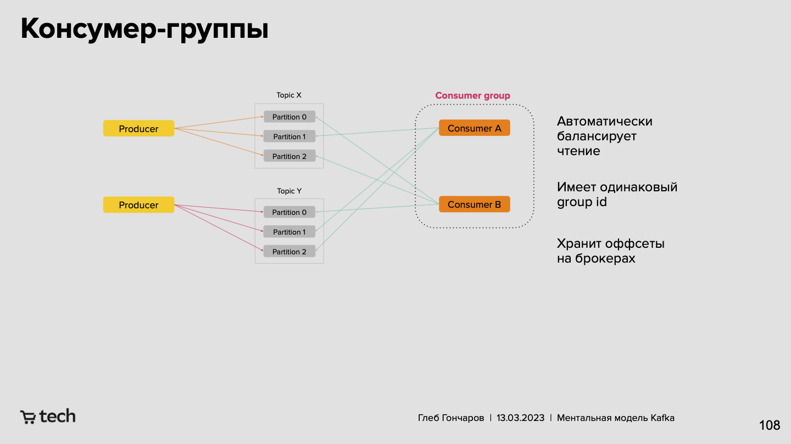

Перед глазами у вас по-прежнему каноничная диаграмма: с левой стороны продюсеры, в середине топики, а справа расположены консумеры. Есть два продюсера, каждый из которых пишет в свой топик, у каждого топика есть три партиции. 

Есть одна консумер-группа с двумя экземплярами одной и той же программы. Т.е. это одна и та же программа, запущенная два раза. Эта программа-консумер читает два топика: X и Y.

Консумер подключается к брокеру с лидерской партицией, поллит изменения в партиции, считывает сообщения, наполняет буфер, а затем проводит обработку полученных сообщений.

Обратите внимание на распределение партиций между ними: они распределены кооперативно: каждому потребителю досталось по три партиции. Распределение партиций между консумерами в пределах одной группы выполняется автоматически на стороне брокеров Kafka. Kafka старается честно распределять партиции между консумер-группами, насколько это возможно.

При этом каждая такая группа имеет свой идентификатор, позволяя регистрироваться на брокерах Kafka. Пространство имён консумер-групп глобально, а значит имена консумер-групп в кластере Kafka уникальны.

И, наконец, самое главное: Kafka сохраняет на своей стороне текущий оффсет по каждой партиции топиков, входящих в состав консумер-группы. Это значит, что при подключении или отключении консумеров от группы, чтение продолжится с последней сохранённой позиции. Это делает консумер-группы незаменимыми при работе event-driven систем: мы можем без проблем деплоить наши приложения, не задумываясь о хранении оффсета на стороне клиента.

Для этого консумер в группе, после обработки прочитанных сообщений отправляет запрос на сохранение оффсета — или же коммитит свой оффсет. Технически, нет никаких ограничений на то, чтобы коммитить оффсет и до обработки сообщений, однако для большинства сценариев разумнее делать это после.

#### Ребалансировка консумер-групп

Давайте рассмотрим сценарий, когда композиция группы меняется. В кластере Kafka консумер-группы создаются автоматически при подключении консумеров к кластеру и создавать её вручную нет необходимости, но это возможно через её инструментарий. У новой группы отсутствуют сохранённые оффсеты партиций топиков и по умолчанию равны `-1`.

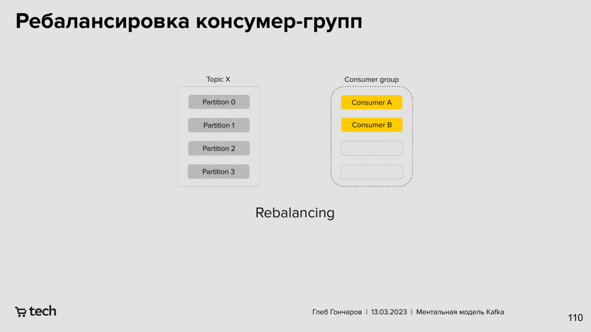

При появлении новых участников в группе (`JoinGroup`), в специальном процессе брокера Group Coordinator первому вошедшему консумеру присваивается роль Group Leader.

Лидер группы отвечает за распределение партиций между всеми участниками группы. Процесс поиска лидера группы, назначения партиций, стабилизации и подключения консумеров в группе к брокерам называется **ребалансировкой консумер-группы**.

Процесс ребалансировки группы по умолчанию заставляет все консумеры в группе прекратить чтение, дождаться полной синхронизации участников, чтобы обрести новые партиции для чтения. В Kafka есть и другие стратегии ребалансировки группы, включая Static membership или Cooperative Incremental Partition Assignor, но об этом как-нибудь в другой раз.

Как только группа стала стабильной, а её участники получили партиции, то консумеры в ней начинают чтение. Поскольку группа новая и раньше не существовала, то консумер выбирает позицию чтения оффсета: с самого начала (earliest) или же с конца (latest). Топик мог существовать несколько месяцев, а консумер появиться совсем недавно и важно решить: читать ли все сообщения или же достаточно читать с конца самые последние, пропустив всю историю.

Выбор между двумя опциями зависит от бизнес-логики протекающих внутри топика событий. Учитывайте это при настройке консумеров. 

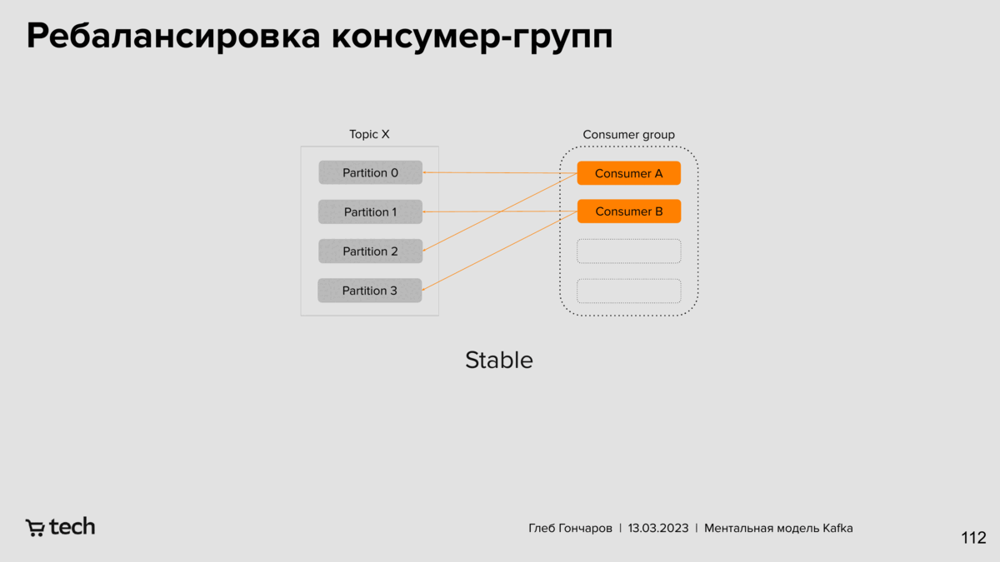

Если в группу добавить нового участника, процесс ребалансировки запускается вновь. Новому участнику, как и уже имеющимся консумерам в группе будут назначены партиции, а лидер группы постарается их распределить между всеми более или менее честно, согласно выбранной им настраиваемой стратегии. Затем группа вновь переходит в стабильное состояние.

Для того, чтобы Group Coordinator в кластере Kafka знал о том, какие из его участников активны и работают, а какие уже нет — каждый консумер в группе регулярно в равные промежутки времени отправляет Heartbeat-сообщение. Это значение настраивается программой-консумером перед запуском.

Также консумер объявляет и время жизни сессии — если за это время консумер не смог отправить ни одно из Heartbeat-сообщений до брокера, то он покидает группу. Брокер же, напротив, не получив ни одно из Heartbeat-сообщений от своих консумеров, запускает процесс ребалансировки консумеров в группе.

Процесс ребалансировки достаточно болезненный для больших консумер-групп с множеством топиков, поскольку вызывает Stop-The-World во всей группе при малейшей смене композиции участников группы или состава партиций в топиках. Например, при смене лидера партиции в случае выхода брокера из кластера (по причине аварии или плановых работ), Group Coordinator также инициирует ребалансировку.

Поэтому базовая рекомендация к разработчикам программ-консумеров: использовать по одной консумер-группе на топик, а также держать число потребителей не слишком большим, чтобы не запускать ребалансировку много раз, но и не слишком маленьким, чтобы сохранять производительность и надёжность при чтении.

Также значения интервала Heartbeat и время жизни сессии следует устанавливать так, чтобы Heartbeat-интервал был в три-четыре раза меньше, Session timeout. Сами значения выбирайте не слишком большими, чтобы не увеличивать время до обнаружения «выпавшего» консумера из группы, но и не слишком маленьким, чтобы в случае малейших сетевых проблем, группа не уходила в ребалансировку.

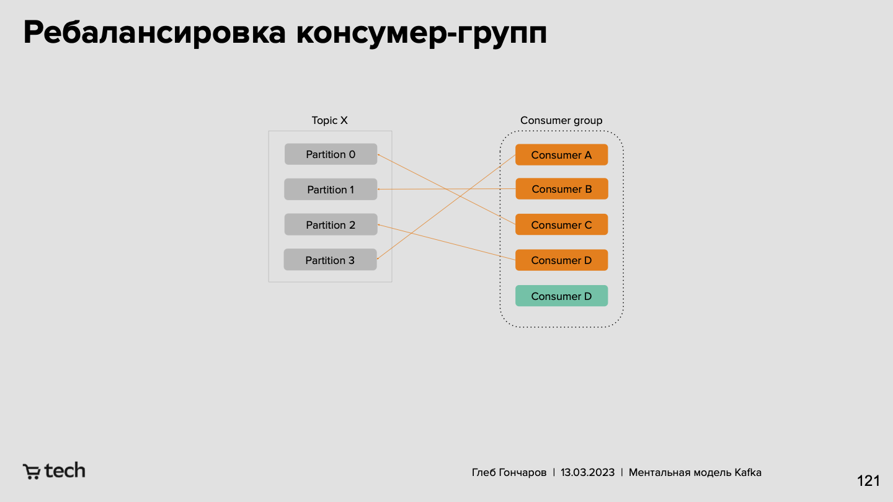

Рассмотрим ещё один гипотетический сценарий: партиций в топике 4, а консумеров в группе 5. В этом случае группа будет стабилизирована, однако участники, которым не достанется ни одна из партиций, будут бездействовать. Такое происходит потому, что с одной партицией в группе может работать только один консумер. Т.е. два и более консумеров не могут читать из одной партиции в группе.

Таким образом, проистекает следующая базовая рекомендация: устанавливайте достаточное число партиций на старте, чтобы вы могли горизонтально масштабировать ваше приложение. Увеличение партиций в моменте не принесёт вам почти никакого результата, поскольку уже записанные в лог сообщения не могут быть перемещены и распределены между новыми партициями средствами Kafka, а репартицирование своими силами всегда несёт риски, связанные с очерёдностью и идемпотентностью.

---

  
TL;DR

Партиции в консумер-группах распределяются автоматически Group Coordinator-ом при помощи Group leader — первого участника в группе. Каждый консумер в группе может читать одну и более партиций разных топиков. Если консумеру не достанется партиции, то он будет бездействовать, что мешает масштабированию.

Основное преимущество консумер-группы перед обычным консумером — в хранении оффсета партиций на стороне брокера. Это позволяет консумерам прерывать работу, а после возобновлять её с того же места, где было окончено чтение.

Для проверки живости консумеров, те обязаны отправлять брокеру Heartbeat-сообщение. Если консумер не успел отправить их брокеру, то консумер может покинуть группу сам, либо же брокер, не получив подтверждение, сам выбросит консумера из группы, что запустит ребалансировку.

Любая смена композиции партиций в топиках и участников в группе запускает ребалансировку. Ребалансировка — болезненный процесс для консумеров. В этот момент все консумеры остановят чтение и не начнут его до полной синхронизации и стабилизации группы. Есть различные алгоритмы ребалансировки, позволяющие смягчить процесс (например, StickyAssignor, Static membership, Incremental Cooperative Rebalancing, …), но по умолчанию — это Stop-The-World.

В новом консумере важно правильно выбрать политику оффсета. Иногда читать с начала не нужно и достаточно «перемотать» оффсет в конец и сразу получать только новые события.

И, наконец, два и более консумеров в группе не могут читать из одной и той же партиции. Чтобы не оказаться в ситуации, когда вам некуда масштабироваться при чтении, заранее установите достаточное число партиций.

---

🎉 Поздравляю! Вы прочитали до конца. Сделайте перерыв на 5-10 минут, а после — переходите [к практике](../guide/001-intro.md).
